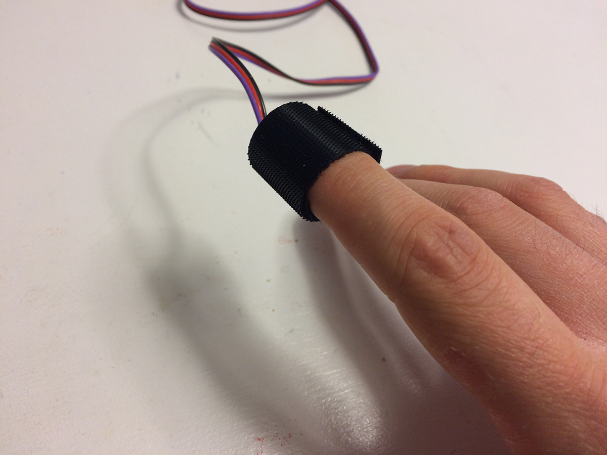
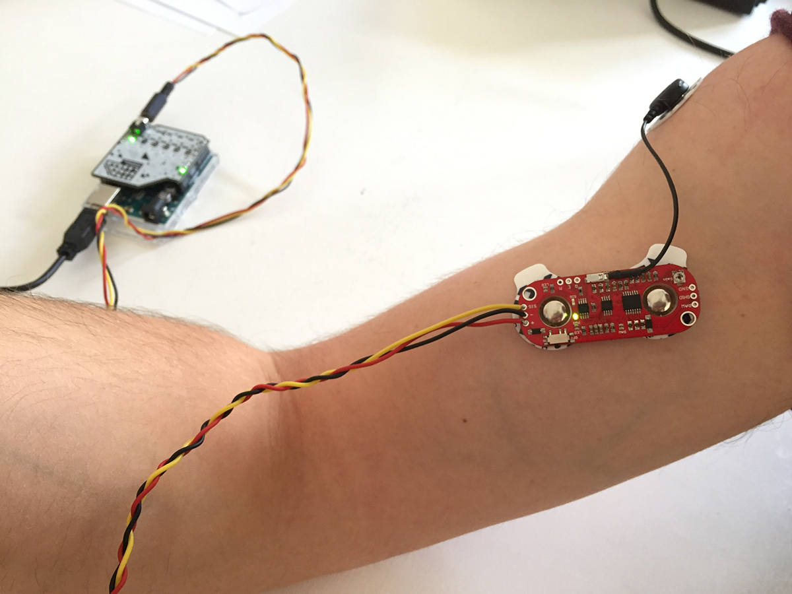

# Sensors
[< Back to overview](README.md)

## ECG (Heatbeat sensor)

This is the [Pulse Sensor](https://pulsesensor.com) heartbeat sensor that can be used to visualize live heartbeats or calculate beats per minute.

### Attaching the sensor to your body

There are two common ways to attach it to your body: either use a velcro strap and attach it to one of your fingers, or clipping it to your earlobe with the  supplied clip. The latter is more prone to fall off, but is easier to use when prototyping (as it leaves your hands free for typing).

### Example data

Heartbeat data of person in rest

* [Heartbeat data in CSV format (50ms interval)](https://github.com/sensorlab030/workshop/blob/master/example-data/heartbeat-50ms.csv)
* [Heartbeat data in JSON format (50ms interval)](https://github.com/sensorlab030/workshop/blob/master/example-data/heartbeat-50ms.json)

### References

* [Technical information from the manufacturer](https://pulsesensor.com/pages/pulse-sensor-amped-arduino-v1dot1)

## EMG (Muscle sensor)

This EMG (electromyography) sensor can measure muscle activation via electric potential.

### Attaching the sensor to your body

1. Prepare the sensor by attaching three electrodes pads to the sensor (two on the red board, one on the short cable)
2. Determine where you want to position the electrodes, one of the electrodes on the board should be in the center of the muscle group, the other one should line up in the direction of the muscle length (see image above). The reference electrode (on the short cable) should be placed on a bony or nonadjacent muscular part of the body.
3. Thoroughly clean the skin with soap and water where you want to apply the electrodes to remove any dirt and skin oils.
4. Remove the protective plastic from the two electrodes on the board and place them on the muscle group
5. Make sure the power switch on the red board is in the "ON" position (PWR led should light up)

### Example data

#### Three slow arm flexes, then three fast arm flexes

* [Muscle sensor data in CSV format (50ms interval)](https://github.com/sensorlab030/workshop/blob/master/example-data/muscle-50ms.csv)
* [Muscle sensor data in JSON format (50ms interval)](https://github.com/sensorlab030/workshop/blob/master/example-data/muscle-50ms.json)

#### Three slow arm flexes, then six fast arm flexes with Simple moving average smoothing

* [Muscle sensor data in CSV format (50ms interval, Simple Moving Average smoothing)](https://github.com/sensorlab030/workshop/blob/master/example-data/muscle-50m-sma.csv)
* [Muscle sensor data in JSON format (50ms interval, Simple Moving Average smoothing)](https://github.com/sensorlab030/workshop/blob/master/example-data/muscle-50ms-sma.json)

### References

* [MyoWare muscle sensor manual](https://github.com/AdvancerTechnologies/MyoWare_MuscleSensor/raw/master/Documents/AT-04-001.pdf)

## Sound sensor

This sensor board captures audio information. We capture the audio envelope, which gives you a way to read the amplitude of sound to detect ambient sound, or people speaking at different levels of intensity.

### Example data

First ~20 seconds of the sound envelope of the [Imperial March](https://www.youtube.com/watch?v=-bzWSJG93P8)

* [Sound sensor data in CSV format (10ms interval)](https://github.com/sensorlab030/workshop/blob/master/example-data/sound-10ms.csv)
* [Sound sensor data in JSON format (10ms interval)](https://github.com/sensorlab030/workshop/blob/master/example-data/sound-10ms.json)

### References

* [Hookup guide (includes an explanation of what the envelope measurement is)](https://learn.sparkfun.com/tutorials/sound-detector-hookup-guide)

## Flex sensor

The flex sensor allows you to detect for instance bending of a joint (such as your finger joints). Whenever the sensor is bent, the input signal drops accordingly.

### Attaching the sensor to your body

The easiest way to attach the sensor to your body is to use sports tape to tape it to your limbs. Take care only to flex the striped area of the sensor and not the part where the wires are connected, which would cause the sensor or the wires to break.

### Example data

Data captured with the sensor connected to the index finger over the first joint (closest to the hand):

#### Three slow finger flexes, then three fast finger flexes, followed by another three slow finger flexes

* [Flex sensor data in CSV format (10ms interval)](https://github.com/sensorlab030/workshop/blob/master/example-data/flex-10ms.csv)
* [Flex sensor data in JSON format (10ms interval)](https://github.com/sensorlab030/workshop/blob/master/example-data/flex-10ms.json)

#### Three slow finger flexes, then three fast finger flexes, followed by another three slow finger flexes with Simple moving average smoothing

* [Flex sensor data in CSV format (10ms interval, Simple Moving Average smoothing)](https://github.com/sensorlab030/workshop/blob/master/example-data/flex-10m-sma.csv)
* [Flex sensor data in JSON format (10ms interval, Simple Moving Average smoothing)](https://github.com/sensorlab030/workshop/blob/master/example-data/flex-10ms-sma.json)

### References

* [Hookup guide](https://learn.sparkfun.com/tutorials/flex-sensor-hookup-guide)

## Pressure sensor

This Force Sensitive Resistor changes it's resistance when the pressure applied to it changes. The harder it is pressed, the lower the resistance will be (and thus, the higher the measured value).

### Example data

First ~20 seconds of the sound envelope of the [Imperial March](https://www.youtube.com/watch?v=-bzWSJG93P8)

* [Pressure sensor data in CSV format (10ms interval)](https://github.com/sensorlab030/workshop/blob/master/example-data/pressure-10ms.csv)
* [Pressure sensor data in JSON format (10ms interval)](https://github.com/sensorlab030/workshop/blob/master/example-data/pressure-10ms.json)

### References

* [In-depth integration guide](https://www.sparkfun.com/datasheets/Sensors/Pressure/fsrguide.pdf)
* [Hookup guide](https://learn.sparkfun.com/tutorials/force-sensitive-resistor-hookup-guide)

